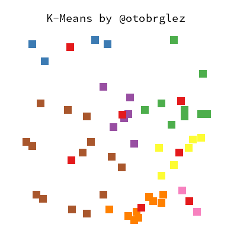

# k8r

Playing around with K-Means, K-Means++, K-Means||,...



## Develpment

```bash
make clean \
    build \ # generates picture
    record  # generates animation
open x.png
```

## Author

- [Oto Brglez](https://github.com/otobrglez)
